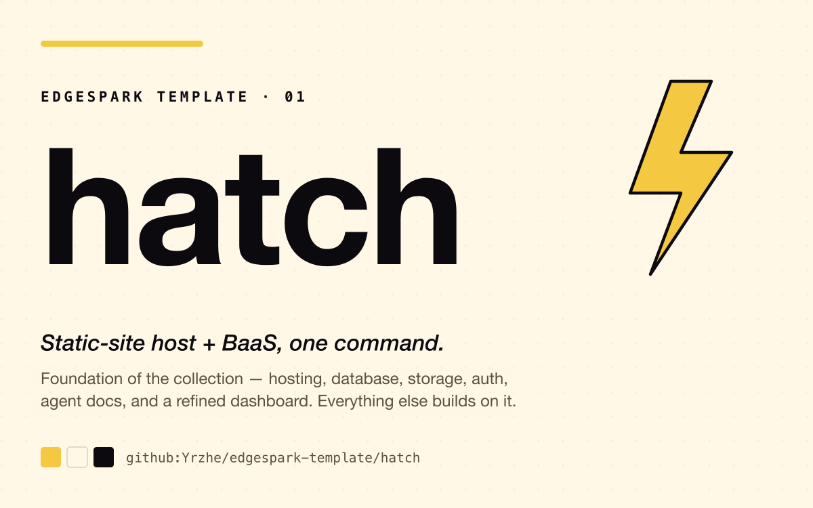
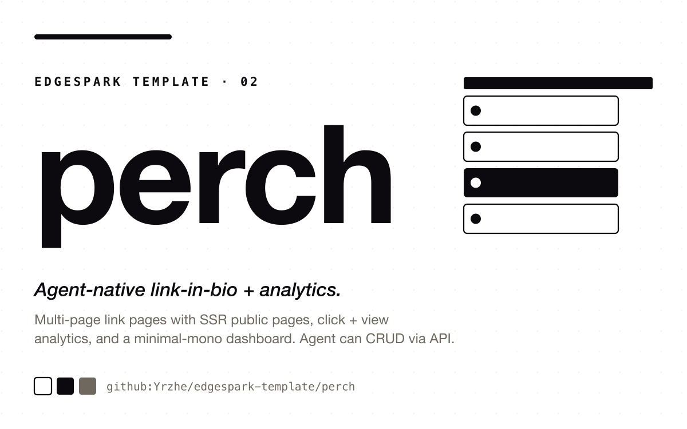
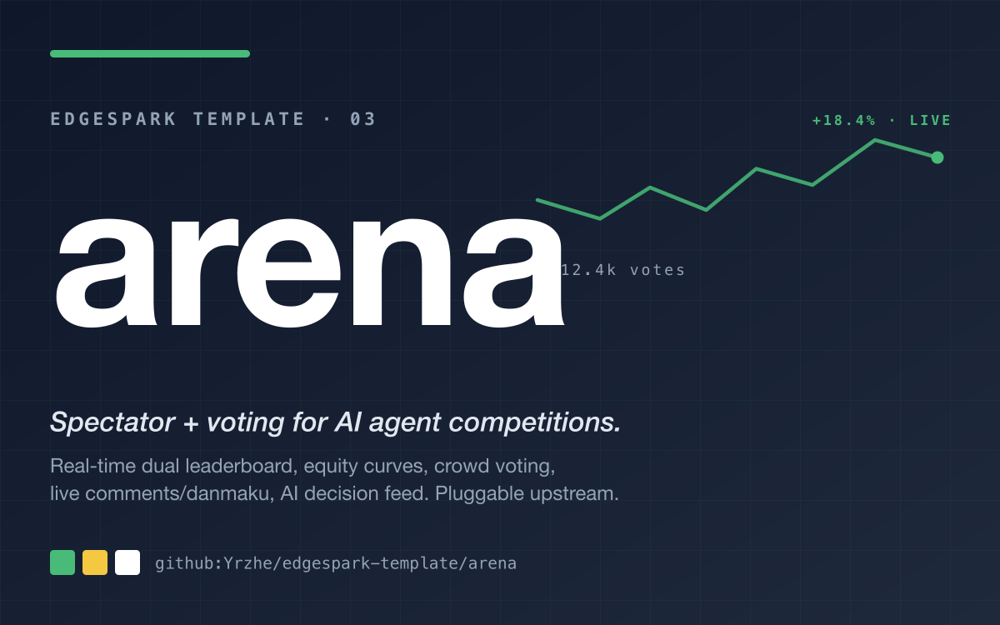
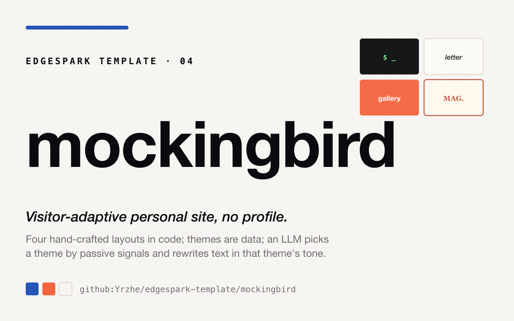

# EdgeSpark Templates

<p align="center">
  
</p>

A collection of one-command, AI-agent-native templates for [EdgeSpark](https://edgespark.dev).
Each lives in its own subdirectory and is initialized directly from GitHub:

```bash
edgespark init my-app --agent claude --template github:Yrzhe/edgespark-template/<template>
```

## Templates

<table>
<tr>
<td width="280"><a href="./hatch"></a></td>
<td><b><a href="./hatch">hatch</a></b> 🐣⚡ &nbsp;·&nbsp; <i>Static-site host + BaaS, one command.</i><br/>
AI-agent-native static-site host with a built-in backend (hosting + BaaS + agent docs) and a refined dashboard. Foundation of the collection — everything else builds on it.<br/><br/>
<code>edgespark init my-hatch --agent claude --template github:Yrzhe/edgespark-template/hatch</code>
</td>
</tr>
<tr>
<td><a href="./perch"></a></td>
<td><b><a href="./perch">perch</a></b> 🐦 &nbsp;·&nbsp; <i>Agent-native link-in-bio + analytics.</i><br/>
Multi-page link pages with SSR public pages, first-party click + view analytics, a minimal-mono dashboard, and a Bearer-authenticated management API so your AI agent can build the page for you.<br/><br/>
<code>edgespark init my-perch --agent claude --template github:Yrzhe/edgespark-template/perch</code>
</td>
</tr>
<tr>
<td><a href="./arena"></a></td>
<td><b><a href="./arena">arena</a></b> 🏆 &nbsp;·&nbsp; <i>Spectator + voting for AI agent competitions.</i><br/>
Real-time dual leaderboard, stock-chart equity curves, crowd ❤ voting, live comments/danmaku, and an AI decision feed. Pluggable upstream — point it at any agent-competition data source.<br/><br/>
<code>edgespark init my-arena --agent claude --template github:Yrzhe/edgespark-template/arena</code>
</td>
</tr>
<tr>
<td><a href="./mockingbird"></a></td>
<td><b><a href="./mockingbird">mockingbird</a></b> 🪶 &nbsp;·&nbsp; <i>Visitor-adaptive personal site, no profile.</i><br/>
Four hand-crafted layouts in code; themes (palette + fonts + match rules + copy tone) are CRUD-able data; an LLM picks a theme by passive visitor signals and rewrites text in the theme's tone — first paint never blocks on the model. The LLM never invents owner facts and never sees precise visitor data.<br/><br/>
<code>edgespark init my-mockingbird --agent claude --template github:Yrzhe/edgespark-template/mockingbird</code>
</td>
</tr>
</table>

See each template's own `README.md` for full details and setup.

## License

MIT
