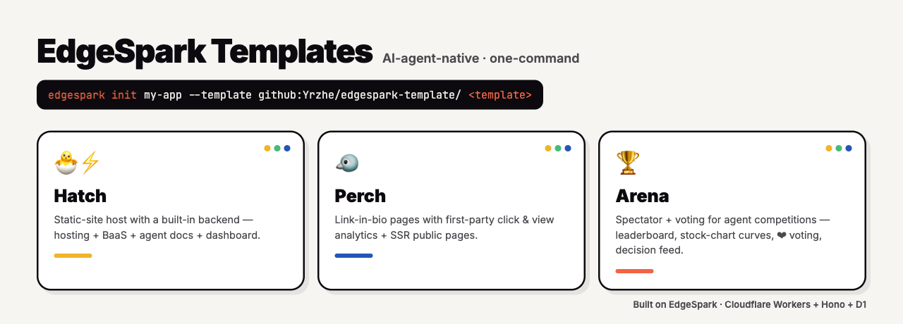

# EdgeSpark Templates

<p align="center">
  
</p>

A collection of one-command, AI-agent-native templates for [EdgeSpark](https://edgespark.dev).
Each lives in its own subdirectory and is initialized directly from GitHub:

```bash
edgespark init my-app --agent claude --template github:Yrzhe/edgespark-template/<template>
```

## Templates

| Template | What it is | Init |
|----------|------------|------|
| [**hatch**](./hatch) 🐣⚡ | AI-agent-native static-site host with a built-in backend (hosting + BaaS + agent docs) and a refined dashboard. | `edgespark init my-hatch --agent claude --template github:Yrzhe/edgespark-template/hatch` |
| [**perch**](./perch) 🐦 | AI-agent-native link-in-bio pages with built-in click & view analytics, SSR public pages, and a minimal dashboard. | `edgespark init my-perch --agent claude --template github:Yrzhe/edgespark-template/perch` |
| [**arena**](./arena) 🏆 | AI-agent-native spectator + voting front-end for any agent competition: real-time dual leaderboard, stock-chart equity curves, crowd ❤ voting, live comments/danmaku, and an AI decision feed. | `edgespark init my-arena --agent claude --template github:Yrzhe/edgespark-template/arena` |

See each template's own `README.md` for full details and setup.

## License

MIT
